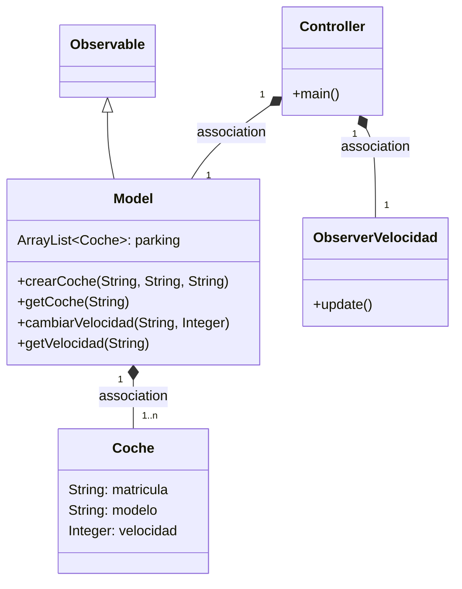
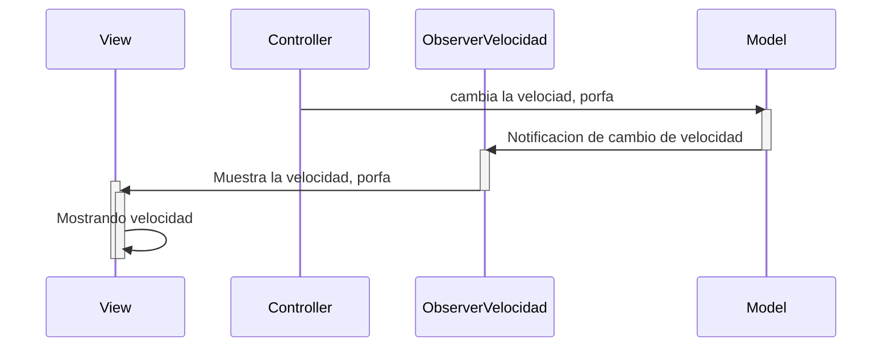

# Arquitectura MVC con Observer

En esta rama utilizaremos el patrón Observer

Los cambios de la velocidad que se hagan en el model
serán observados por el Controller

Para notificar a los observadores hacemos dos pasos

* Actualizamos el estado a 'algo a cambiado' con `setChanged()`
* Notificamos a los observadores `notifyObservers(valor)`

De esta manera se *dispara* en todos los observadores el método `update()`

---

## Diagrama de clases:

---

## Diagrama de Secuencia

Que ocurre cuando se cambia la velocidad

El mismo diagrama con los nombres de los métodos.
